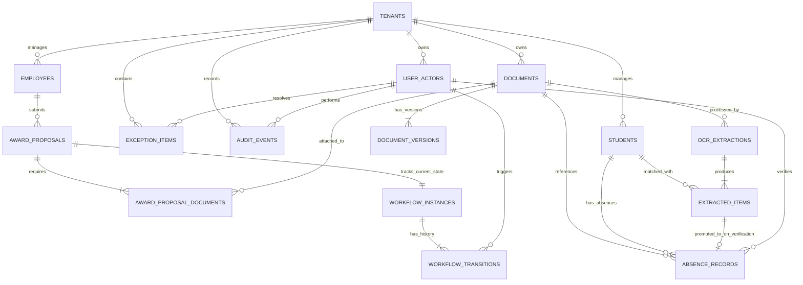

# 02 - Data Model & Entity Specification

**System**: Banyubiru Administrative Intelligence Platform  
**Document**: Phase 4A Refined Data Model & ERD Specification  
**Status**: NON-CODE ARCHITECTURAL SPECIFICATION  

---

## 1. Complete Entity Dictionary

| Entitas | Tujuan / Deskripsi | Status Source of Truth | Relasi Utama | Lifecycle / State |
|---|---|---|---|---|
| **`Tenant`** | Batas isolasi organisasi / instansi. | **Primary Source of Truth** | 1:N UserActor, 1:N Student, 1:N Employee | Active / Suspended |
| **`UserActor`** | Akun pengguna pengoperasi platform. | **Primary Source of Truth** | N:1 Tenant, 1:N AuditEvent | Active / Inactive |
| **`Employee`** | Identitas resmi pegawai (SIMPEG). | **Primary Source of Truth** | 1:N AwardProposal | Active / Retired / Transferred |
| **`AwardProposal`** | Transaksi usulan penghargaan pegawai. | **Primary Source of Truth** | N:1 Employee, 1:N ProposalDoc, 1:1 WorkflowInstance | `NOMINATIF` -> `BELUM_UPLOAD` -> `SEBAGIAN` -> `LENGKAP` -> `SIAP_GENERATE` -> `GENERATED` -> `APPROVED` |
| **`AwardProposalDocument`**| Pivot dokumen pendukung usulan pegawai. | **Primary Source of Truth** | N:1 AwardProposal, N:1 Document | Attached / Verified / Rejected |
| **`Student`** | Identitas resmi siswa (Dapodik). | **Primary Source of Truth** | 1:N AbsenceRecord, 1:N ExtractedItem (Match) | Active / Graduated / Transferred |
| **`AbsenceRecord`** | Rekap resmi ketidakhadiran siswa terverifikasi. | **Primary Source of Truth (Absensi)** | N:1 Student, N:1 Document, N:1 UserActor (Verifier) | Recorded / Verified / Archived |
| **`Document`** | Entitas platform dokumen fisik/digital. | **Primary Source of Truth (File)** | 1:N DocumentVersion, N:1 Tenant | Draft / Active / Archived |
| **`DocumentVersion`** | Histori versi file dokumen & hash integrity. | **Primary Source of Truth (Version)** | N:1 Document | Original / Updated / Archived |
| **`OCRExtraction`** | Header hasil ekstraksi OCR atas dokumen. | **Derived / Transient Draft** | N:1 Document, 1:N ExtractedItem | Processing / Completed / Failed |
| **`ExtractedItem`** | Item kandidat ekstraksi OCR per baris. | **Derived / Transient Draft** | N:1 OCRExtraction, 0..1:1 Student | Pending -> Verified / Rejected |
| **`WorkflowInstance`** | State tracker alur kerja entitas bisnis. | **Primary Source of Truth (State)** | 1:N WorkflowTransition | Current State Indicator |
| **`WorkflowTransition`** | Histori ledger transisi workflow *immutable*. | **Primary Source of Truth (Ledger)** | N:1 WorkflowInstance, N:1 UserActor | Immutable Transition Record |
| **`ValidationResult`** | Hasil evaluasi aturan validasi. | **Transient Snapshot** | N:1 Entity, N:1 Rule | Pass / Fail |
| **`ExceptionItem`** | Item antrean pengecualian aturan (*Exception Queue*). | **Primary Source of Truth (Queue)** | N:1 Tenant, N:1 UserActor (Resolver) | `OPEN` -> `IN_REVIEW` -> `RESOLVED` / `DISMISSED` |
| **`AuditEvent`** | Log jejak audit aktivitas platform *immutable*. | **Primary Source of Truth (Audit)** | N:1 Tenant, N:1 UserActor | Immutable Insert-Only Record |

---

## 2. Complete Entity Relationship Diagram (Mermaid ERD)

---

## 3. Relational vs. Polymorphic Reference Strategy

Untuk menjamin **Integrasi Referensial (Foreign Key Integrity)** dan performa database relasional:

### A. Strict Relational Foreign Keys (Kunci Asing Relasional Mutlak)
Gunakan Kunci Asing relasional langsung (`REFERENCES table(id)`) pada entitas bisnis inti:
- `award_proposals.employee_id` -> `employees.id`
- `award_proposal_documents.proposal_id` -> `award_proposals.id`
- `award_proposal_documents.document_id` -> `documents.id`
- `absence_records.student_id` -> `students.id`
- `absence_records.document_id` -> `documents.id`
- `extracted_items.ocr_extraction_id` -> `ocr_extractions.id`

### B. Controlled Polymorphic References (Entitas Core Platform)
Untuk *Platform Core Engines* yang bersifat domain-agnostic (`ExceptionItem`, `AuditEvent`, `WorkflowInstance`), gunakan pasangan `entity_type` + `entity_id` dengan validasi constraint di layer aplikasi:
- **`audit_events`**: `entity_type` (`AwardProposal`, `AbsenceRecord`, `Document`) + `entity_id`.
- **`exception_items`**: `entity_type` (`AwardProposal`, `ExtractedItem`) + `entity_id`.
- **`workflow_instances`**: `entity_type` + `entity_id`.
