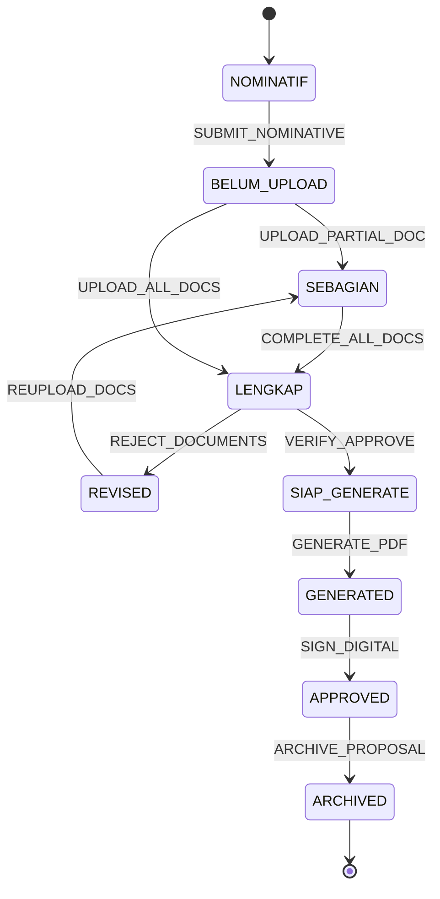
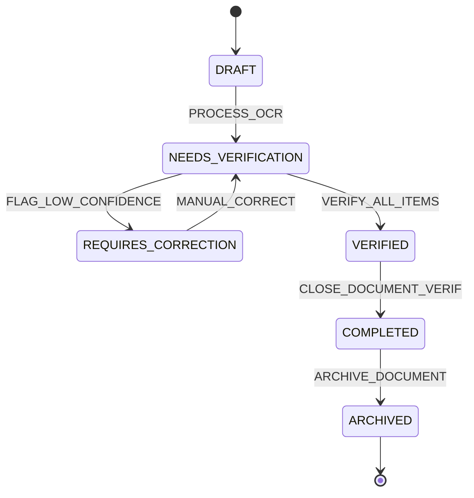

# 03 - Workflow Architecture & Persistence Specification

**System**: Banyubiru Administrative Intelligence Platform  
**Document**: Phase 4A Refined Workflow State Machine Specification  
**Status**: NON-CODE ARCHITECTURAL SPECIFICATION  

---

## 1. Separation of Current State vs. Transition Ledger

Platform memisahkan secara tegas antara **Status Terkini Entitas** (`WorkflowInstance`) dan **Jejak Transisi Historis** (`WorkflowTransition`).

```
┌─────────────────────────────────────────────────────────────┐
│                 WorkflowInstance (Current State)            │
│  entity_type: "AwardProposal" | entity_id: "prop-101"        │
│  current_state: "SIAP_GENERATE" | updated_at: 2026-08-26    │
└──────────────────────────────┬──────────────────────────────┘
                               │
                               ▼ 1:N
┌─────────────────────────────────────────────────────────────┐
│              WorkflowTransition (Immutable Ledger)          │
│  [Tr-1]: NOMINATIF ──► BELUM_UPLOAD   (by User-01 @ 08:00) │
│  [Tr-2]: BELUM_UPLOAD ──► SEBAGIAN    (by User-01 @ 09:15) │
│  [Tr-3]: SEBAGIAN ──► LENGKAP        (by System  @ 10:00) │
│  [Tr-4]: LENGKAP ──► SIAP_GENERATE   (by Verifier@ 11:30) │
└─────────────────────────────────────────────────────────────┘
```

---

## 2. Employee Award Workflow State Machine Specification

### State Taxonomy:
1. `NOMINATIF`: Pegawai masuk dalam daftar nominatif usulan awal.
2. `BELUM_UPLOAD`: Usulan diinisiasi, belum ada dokumen pendukung diunggah.
3. `SEBAGIAN`: Sebagian dokumen pendukung wajib telah diunggah.
4. `LENGKAP`: Seluruh dokumen wajib (`SK CPNS`, `SK PNS`, `SK Pangkat`, `SKP`) terunggah & lulus check.
5. `REVISED`: Usulan dikembalikan ke pengusul untuk perbaikan berkas.
6. `SIAP_GENERATE`: Usulan disetujui verifikator BKD, siap diterbitkan SK / PDF.
7. `GENERATED`: Dokumen SK PDF berhasil dicetak oleh sistem.
8. `APPROVED`: SK ditandatangani secara digital oleh Pejabat Berwenang.
9. `ARCHIVED`: Usulan dan SK diarsipkan ke arsip permanen.



---

## 3. Student Absence Workflow State Machine Specification

### State Taxonomy:
1. `DRAFT`: Berkas surat/dokumen gambar diunggah ke sistem.
2. `NEEDS_VERIFICATION`: Ekstraksi OCR selesai, menunggu verifikasi manusia (*Human Verification*).
3. `REQUIRES_CORRECTION`: Ekstraksi OCR memiliki confidence `<70%` atau data ambigu (NISN tidak cocok).
4. `VERIFIED`: Seluruh item ekstraksi telah dikonfirmasi/dikoreksi oleh operator manusia dan dipromosikan menjadi `AbsenceRecord`.
5. `COMPLETED`: Seluruh proses verifikasi dalam dokumen selesai.
6. `ARCHIVED`: Berkas surat fisik/digital diarsipkan.



---

## 4. Rule Penting: Output Actions vs. Workflow Completion

### Penegasan Arsitektur:
Tindakan ekspor laporan (seperti **Download Excel Rekap** atau **Export PDF Summary**):
- **BUKAN MERUPAKAN TRANSISI STATUS WORKFLOW BISNIS (`WorkflowTransition`)**.
- **MERUPAKAN ACTION EVENT / AUDIT EVENT (`AuditEvent`)**.

Mengunduh file Excel tidak boleh secara otomatis mengubah status dokumen menjadi `COMPLETED` atau `ARCHIVED`. Status workflow bisnis hanya berubah ketika entitas memenuhi kriteria verifikasi bisnis resmi.
