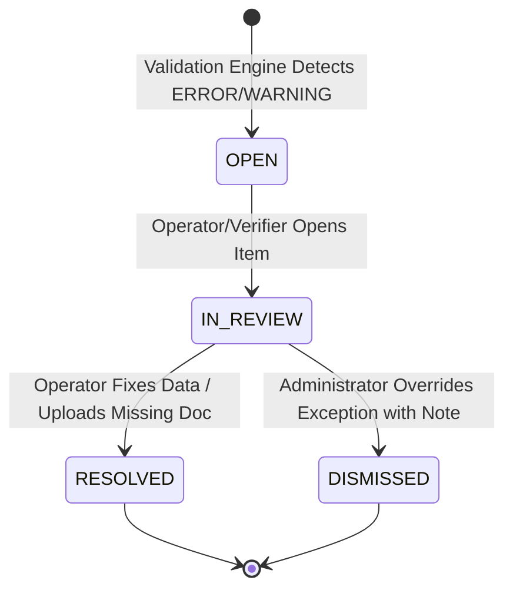

# 04 - Validation & Exception Engine Specification

**System**: Banyubiru Administrative Intelligence Platform  
**Document**: Phase 4A Validation Engine & Exception Queue Architecture  
**Status**: NON-CODE ARCHITECTURAL SPECIFICATION  

---

## 1. Validation Architecture Overview

Proses validasi dijalankan secara terpisah dari logika UI melalui **`PlatformValidationEngine`**. Validasi menghasilkan array dari `ValidationResult`:

```
[Target Entity] ──► [PlatformValidationEngine]
                          │
                          ├──► Evaluasi Rules
                          │
                          ▼
             [ValidationResult Array]
                          │
              ┌───────────┴───────────┐
              ▼                       ▼
      (Valid = true)          (Valid = false)
   Lanjut Workflow Transition   Memicu Exception Creation
                                      │
                                      ▼
                          [PlatformExceptionQueue]
```

---

## 2. Validation Severity Taxonomy

| Severity | Definisi Business Impact | Tindakan Platform |
|---|---|---|
| **`CRITICAL`** | Pelanggaran hukum/regulasi berat (misal: Pernah dijatuhi hukuman disiplin berat berdasarkan SE BKD No. 22/SE/2026). | **Blokir Mutlak Transisi Workflow**. Memicu Exception `ERROR` ber-prioritas tinggi. |
| **`ERROR`** | Syarat dokumen/data wajib belum dipenuhi (misal: SK CPNS belum diunggah, NISN tidak ditemukan di Dapodik). | **Blokir Transisi ke State Berikutnya** hingga berkas disusulkan / dikoreksi. |
| **`WARNING`** | Peringatan kualitas data (misal: Akurasi ekstraksi OCR `< 70%`, ejaan nama siswa sedikit berbeda). | **Tidak Memblokir**, namun memerlukan peninjauan dan konfirmasi operator manusia. |
| **`INFO`** | Catatan informasi administratif tambahan. | Hanya ditampilkan sebagai catatan pendukung di UI. |

---

## 3. Exception Queue Lifecycle Specification

Entitas `ExceptionItem` mengelola item antrean kesalahan pada *Unified Exception Center*:



### Attributes Contract `ExceptionItem`:
- `id`: Primary Key (`exc-uuid`).
- `tenant_id`: Multi-tenant isolation key.
- `entity_type`: Target entity class (`AwardProposal`, `ExtractedItem`, `Student`).
- `entity_id`: FK target entity.
- `rule_id`: Identifier aturan yang mengevaluasi (`SE_BKD_22_2026_RULE`, `OCR_CONFIDENCE_RULE`, dll).
- `severity`: `CRITICAL` | `ERROR` | `WARNING` | `INFO`.
- `status`: `OPEN` | `IN_REVIEW` | `RESOLVED` | `DISMISSED`.
- `message`: Deskripsi kesalahan berbahasa Indonesia yang jelas.
- `resolved_by`: Foreign Key `UserActor` penyelesai.
- `resolution_note`: Alasan/catatan koreksi manual mutlak wajib saat status diubah menjadi `RESOLVED` / `DISMISSED`.

---

## 4. Catalogue Aturan Bisnis Terdaftar (Registered Business Rules)

### A. Subdomain Employee Award
1. **`SE_BKD_22_2026_RULE`**: Menilai kelayakan penghargaan berdasarkan SE BKD No. 22/SE/2026 (Bebas hukuman disiplin sedang/berat).
2. **`MASA_KERJA_ELIGIBILITY_RULE`**: Menilai kelayakan masa kerja (10, 20, 30 tahun) berdasarkan TMT CPNS riil.
3. **`SATYALANCANA_TIER_RULE`**: Menilai kesesuaian jenjang Satyalancana (X, XX, XXX) sesuai riwayat penerimaan sebelumnya.
4. **`DOC_COMPLETENESS_RULE`**: Memeriksa kelengkapan 4 dokumen wajib (`SK CPNS`, `SK PNS`, `SK Pangkat`, `SKP 2 Thn`).

### B. Subdomain Student Absence
1. **`STUDENT_NISN_FORMAT_RULE`**: Memeriksa kelayakan format NISN 10-digit angka.
2. **`OCR_CONFIDENCE_THRESHOLD_RULE`**: Memeriksa skor akurasi OCR. Jika `< 70%`, buat Exception `WARNING` untuk verifikasi manual.
3. **`ABSENCE_DATE_VALIDITY_RULE`**: Memeriksa agar tanggal ketidakhadiran tidak melebihi tanggal hari ini (future date check).
