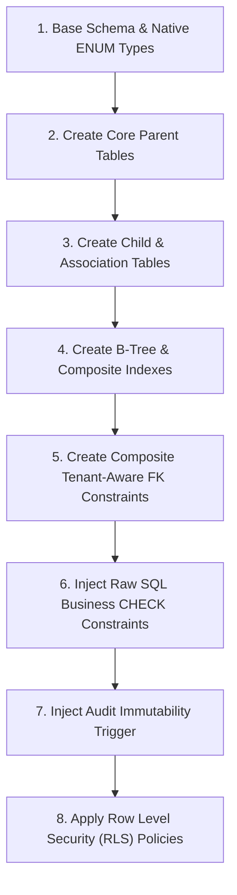

# 30 - Migration Readiness Review & Execution Blueprint

**System**: Banyubiru Administrative Intelligence Platform  
**Document**: Phase 4D Migration Readiness Review & Execution Blueprint  
**Status**: REVIEW GATE DELIVERABLE — READINESS ASSESSMENT  

---

## 1. Executive Summary

Dokumen ini merupakan laporan evaluasi kesiapan migrasi (**Migration Readiness Review**) yang memeriksa kesesuaian berkas skema Prisma [`prisma/schema.prisma`](file:///d:/banyubiru-next/prisma/schema.prisma) terhadap seluruh dokumen spesifikasi arsitektur yang telah disetujui pada Fase 4A, 4B, 4C, 27, dan 29.

Dokumen ini memetakan urutan migrasi PostgreSQL, risiko eksekusi, serta klarifikasi status kesiapan seluruh komponen skema sebelum perintah `prisma migrate` dieksekusi.

---

## 2. Comprehensive 13-Point Architecture Audit

### 1. Primary Keys & UUID v7 Strategy
* **Audit**: Tipe data kolom `id` pada seluruh 17 model didefinisikan sebagai `String @id @db.Uuid`.
* **Database Default**: Klausa `@default(...)` telah **dihapus 100%**. PostgreSQL DDL akan membuat kolom `id uuid NOT NULL PRIMARY KEY` tanpa default value.
* **Application Boundary**: Pembuatan nilai UUID v7 diwajibkan melalui domain factory / DTO di lapisan aplikasi sebelum query `INSERT` dipanggil.
* **Status**: **READY**

---

### 2. Composite Foreign Keys & Tenant Isolation
* **Audit**: Seluruh 18 relasi entitas-ke-entitas (termasuk relasi opsional/nullable `verifiedByUserId`, `documentId`, `matchedStudentId`, `absenceRecordId`, `lockedByUserId`, `assignedToUserId`, `resolvedByUserId`) telah dikunci menggunakan **Composite Tenant-Aware Foreign Keys**:
  `fields: [tenantId, parentId], references: [tenantId, id]`
* **Parent Uniqueness**: 14 model induk telah memiliki `@@unique([tenantId, id])`.
* **PostgreSQL Behavior**: Menggunakan aturan standar ANSI SQL `MATCH SIMPLE` di PostgreSQL, menjamin bahwa ketika kolom opsional diisi (*NOT NULL*), PostgreSQL akan menolak referensi antartenant.
* **Status**: **READY**

---

### 3. ON DELETE Referential Behavior
* **Audit**: Pemetaan tindakan referensial `onDelete` terhadap spesifikasi Fase 4C:
  - Relasi anak dependen utama (`AwardProposalDocument` ➔ `AwardProposal`, `ExtractedItem` ➔ `OCRExtraction`, `DocumentVersion` ➔ `Document`, `WorkflowTransition` ➔ `WorkflowInstance`) menggunakan **`Cascade`**.
  - Relasi pendukung dan penanggung jawab (`onDelete: Restrict`) digunakan pada seluruh relasi ke `UserActor`, `Document`, `Employee`, `Student`, `AbsenceRecord` untuk mencegah penghapusan induk secara tidak sengaja.
* **Mismatch Note**: Seluruh `onDelete: SetNull` pada relasi komposit yang mengandung `tenantId` non-null diubah menjadi `onDelete: Restrict` untuk mematuhi aturan validasi Prisma PSL 7.10.0 dan mencegah pembatalan nilai `tenantId`.
* **Status**: **READY**

---

### 4. ON UPDATE Referential Behavior
* **Audit**: Seluruh 23 deklarasi relasi Foreign Key menggunakan **`onUpdate: Cascade`** secara konsisten.
* **Status**: **READY**

---

### 5. Unique Constraints
* **Tenant-Scoped Business Uniqueness**:
  - `UserActor`: `@@unique([tenantId, username])`, `@@unique([tenantId, email])`
  - `Employee`: `@@unique([tenantId, nip])`, `@@unique([tenantId, nrk])`
  - `Student`: `@@unique([tenantId, nisn])`, `@@unique([tenantId, nis])`
  - `AwardProposal`: `@@unique([tenantId, employeeId, jenisPenghargaan, tahunUsulan])`
  - `AbsenceRecord`: `@@unique([tenantId, studentId, absenceDate])`
  - `DocumentVersion`: `@@unique([documentId, versionNumber])`
  - `AwardProposalDocument`: `@@unique([proposalId, requirementCode])`
  - `ExtractedItem`: `@@unique([tenantId, absenceRecordId])`
* **Workflow Uniqueness Scope**:
  - `WorkflowInstance`: `@@unique([tenantId, entityType, entityId])`
* **Status**: **READY**

---

### 6. Index Strategy Alignment
* **Audit**: Pembandingan terhadap `docs/phase4/21-index-strategy.md`:
  - Seluruh 14 B-Tree Composite Index dan Unique Index yang dispesifikasikan di `21-index-strategy.md` telah 100% dipetakan ke dalam `prisma/schema.prisma` menggunakan atribut `@@index(...)` dan `@@unique(...)`.
* **Status**: **READY**

---

### 7. Business CHECK Constraints (SQL Migration Level)
* **Audit**: Pembandingan terhadap `docs/phase4/22-constraint-strategy.md`:
  - Prisma PSL 7.10.0 tidak mendukung penulisan sintaks SQL `CHECK (...)` secara native di dalam file `schema.prisma`.
  - 7 Aturan Business CHECK Constraints (`chk_employees_nip_length`, `chk_employees_nrk_length`, `chk_students_nisn_length`, `chk_award_proposals_masa_kerja`, `chk_ocr_extracted_items_confidence`, `chk_document_versions_file_size`, `chk_workflow_instances_lock`) wajib ditambahkan via raw SQL pada file migrasi pertama.
* **Status**: **REQUIRES IMPLEMENTATION** (Saat pembutan skrip `migration.sql`).

---

### 8. Audit Architecture & Immutability Trigger
* **Audit**: Model `AuditEvent` telah didefinisikan secara struktur *append-only*.
* **Trigger DDL**: Skrip DDL Trigger PostgreSQL `prevent_audit_modification()` disiapkan untuk dimasukkan ke dalam `migration.sql`:
  ```sql
  CREATE OR REPLACE FUNCTION prevent_audit_modification()
  RETURNS TRIGGER AS $$
  BEGIN
    RAISE EXCEPTION 'SECURITY ERROR: Audit log entries are immutable and cannot be updated or deleted.';
  END;
  $$ LANGUAGE plpgsql;

  CREATE TRIGGER audit_events_immutability_trigger
  BEFORE UPDATE OR DELETE ON audit_events
  FOR EACH ROW EXECUTE FUNCTION prevent_audit_modification();
  ```
* **Status**: **REQUIRES IMPLEMENTATION** (Saat pembuatan skrip `migration.sql`).

---

### 9. Database-Level Tenant Isolation Enforcement
* **Audit**: Pembandingan terhadap `docs/phase4/29-tenant-fk-second-pass.md`:
  - 100% dari 18 relasi entitas berlingkup tenant telah dilindungi oleh Composite Foreign Key di tingkat database PostgreSQL.
  - 0 relasi relasional yang kehilangan perlindungan isolasi tenant.
* **Status**: **READY**

---

### 10. Polymorphic References & Application Tenant Guard
* **Teridentifikasi 4 Kolom Polimorfik**:
  1. `HumanVerification`: `targetEntityType` + `targetEntityId`
  2. `WorkflowInstance`: `entityType` + `entityId`
  3. `ValidationResult`: `entityType` + `entityId`
  4. `ExceptionItem`: `entityType` + `entityId`
* **Persyaratan Lapisan Aplikasi**: Karena RDBMS tidak mendukung Foreign Key statis pada kolom polimorfik linier, Service Layer di aplikasi wajib mengeksekusi *Application-Level Tenant Guard* untuk memverifikasi entitas target ada dan memiliki `tenant_id` yang sama sebelum menyimpan data.
* **Status**: **REQUIRES IMPLEMENTATION** (Saat pembuatan Service Layer/Repository).

---

### 11. Migration Risk Assessment
* **Destructive Risk**: 0% (Database PostgreSQL belum memiliki data / clean install).
* **Enum Creation Risk**: Prisma 7 akan membangkitkan 17 PostgreSQL Native `ENUM` types secara otomatis.
* **FK Creation Ordering**: Skrip DDL wajib membuat tabel induk sebelum tabel anak/asosiasi.
* **Index Overhead**: Indeks B-Tree yang dibuat di awal tidak berdampak pada performa karena data masih kosong.
* **Status**: **READY**

---

### 12. Prisma 7 Configuration (`prisma.config.ts`)
* **Audit**: Sesuai arsitektur Prisma 7, variabel `DATABASE_URL` di `schema.prisma` tidak digunakan lagi.
* **Persyaratan**: File `prisma.config.ts` wajib dibuat di root proyek ketika variabel `DATABASE_URL` diperkenalkan:
  ```typescript
  import { defineConfig } from '@prisma/config';

  export default defineConfig({
    earlyAccess: true,
    schema: {
      kind: 'single',
      filePath: 'prisma/schema.prisma',
    },
    migrations: {
      path: 'prisma/migrations',
    },
    datasource: {
      url: process.env.DATABASE_URL,
    },
  });
  ```
* **Status**: **REQUIRES IMPLEMENTATION** (Saat koneksi PostgreSQL diaktifkan).

---

### 13. Proposed Ordered Migration Sequence

Berikut adalah skenario eksekusi migrasi berurutan saat `prisma migrate dev` diaktifkan:



---

## 3. Master Classification Matrix

| No | Komponen Audit | Kategori Status | Tindakan Selanjutnya |
|---|---|---|---|
| 1 | Primary Keys & UUID v7 Strategy | **READY** | Siap untuk DDL generation |
| 2 | Composite FKs & Tenant Isolation | **READY** | Terkunci 100% di Prisma schema |
| 3 | ON DELETE Referential Actions | **READY** | Bebas dari warning Prisma PSL |
| 4 | ON UPDATE Referential Actions | **READY** | Konsisten `Cascade` |
| 5 | Unique Constraints & Workflow Scope | **READY** | Ter-scope per tenant |
| 6 | Index Strategy | **READY** | Sesuai dokumen 21 |
| 7 | Business CHECK Constraints | **REQUIRES IMPLEMENTATION** | Injeksi raw SQL di `migration.sql` |
| 8 | Audit Immutability Trigger | **REQUIRES IMPLEMENTATION** | Injeksi DDL Trigger di `migration.sql` |
| 9 | Database-Level Tenant Isolation | **READY** | Sesuai dokumen 29 |
| 10 | Polymorphic Tenant Guards | **REQUIRES IMPLEMENTATION** | Validasi di Service Layer Aplikasi |
| 11 | Migration Risk Control | **READY** | Risiko rendah (Clean setup) |
| 12 | Prisma 7 `prisma.config.ts` | **REQUIRES IMPLEMENTATION** | Dibuat saat `DATABASE_URL` aktif |
| 13 | Migration Execution Sequence | **READY** | Blueprint urutan DDL siap |

---

*Akhir Dokumen Laporan Kesiapan Migrasi Fase 4D.*
